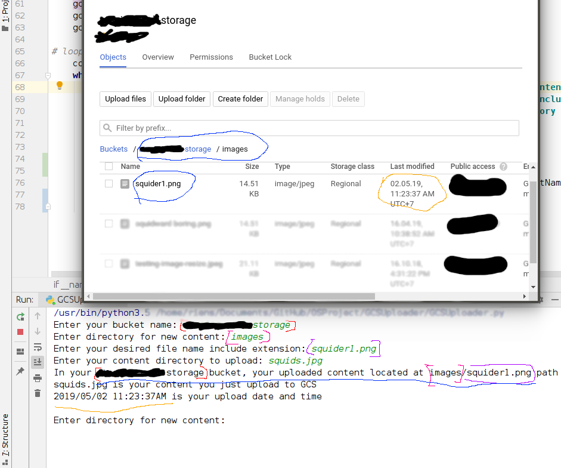

# GCSUploader
Google Cloud Storage Uploader with looping forever input.

Google Cloud Storage Uploader using library that provided by Google.

Work well for administrator that not have access to Google Cloud Platform but need to upload something to Google Cloud Storage.



## Requirements
- Python 3.5
- Google Cloud library
- Google Cloud Service Account
- virtual env (optional)

## Guide to Use
Before run the GCSUploader make sure you already fulfill the requirements.

How to get Google Cloud library and install virtual env you can see in [pypi.org](https://pypi.org/project/google-cloud-storage/)

I assume you already know how to get Google Cloud Service Account.

If the requirement already fulfilled:
1. Assign Google Application Credentials
   - You can do this by using terminal command or declare it from the code inside that I already mark with comment.
if you are using terminal command just run this  command:
```
export GOOGLE_APPLICATION_CREDENTIALS="yourServiceAccount.json"
```
   - But you must aware in this step, if your service account in the same folder with GCSUploader you don't have to add directory where the service account located, else you must add directory location your service account. Last but not least in this step once you move to other directory you must run this command again with the right service account location, if you declare your service account location you don't need to worry everytime you move to other directory, as long as your service account location not moved to other location.

2. Just run it 

   - In this GCSUploader, there are some requirement you must fill it right:
     - **Bucket Name**
     - **Directory** (optional to fill)
     - **Content Name**
     - **Your content that you want to upload**
  
   - For directory, you can leave it blank so your content will located in your bucket root.

3. Check your Google Cloud Storage Bucket

   - If all of your input right, I guarantee your content upload succeeded

Let me know if something wrong or strange happen just email me at: rienslw@outlook.com

Thank You :D
